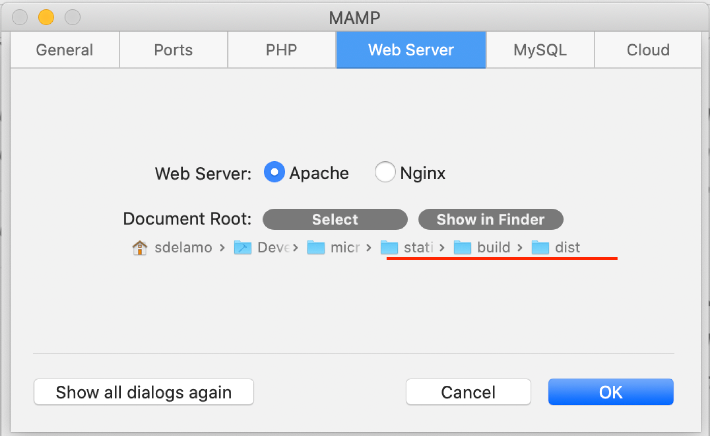
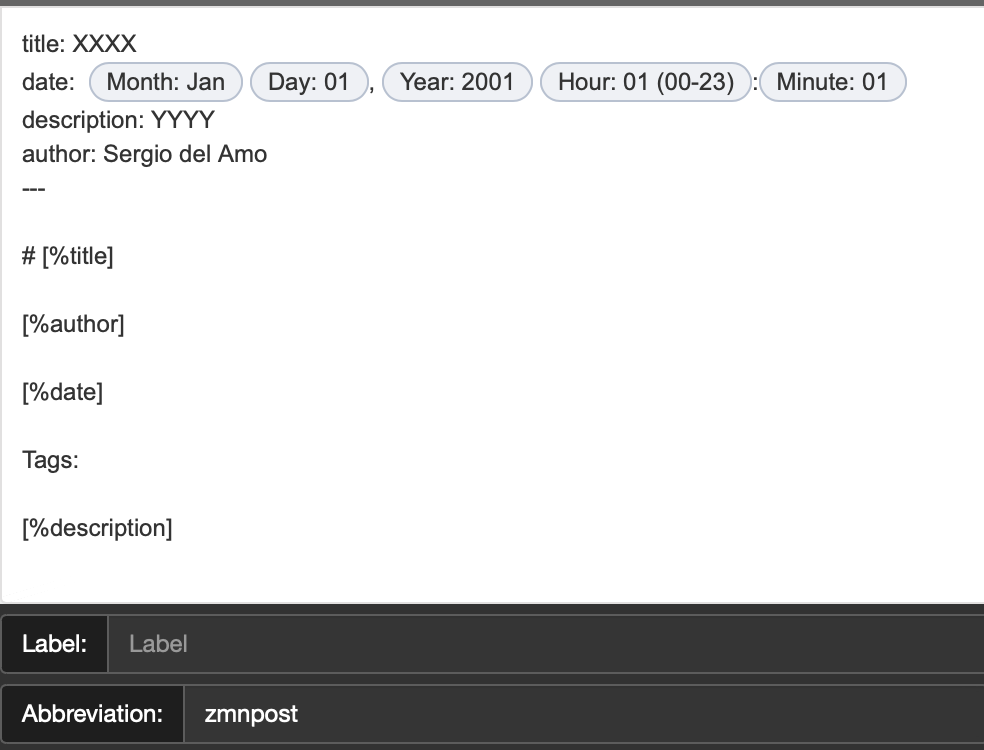
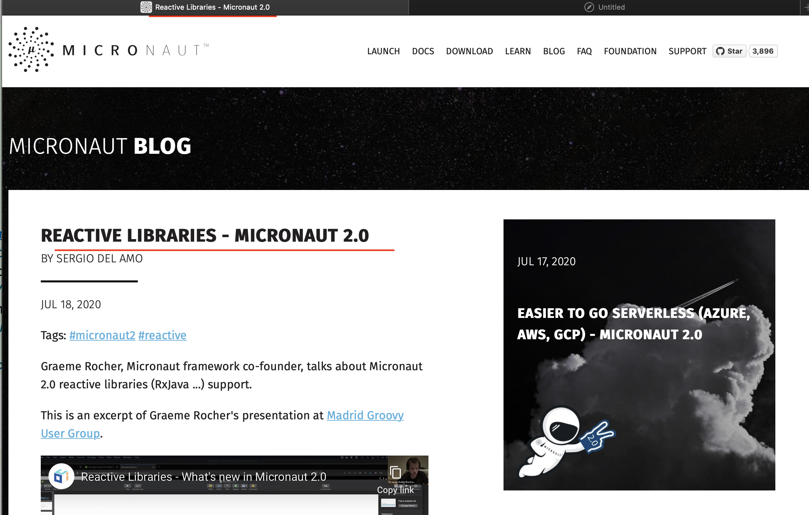
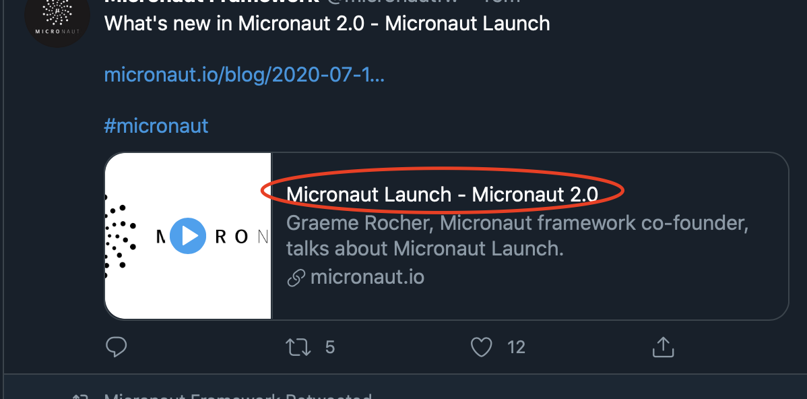
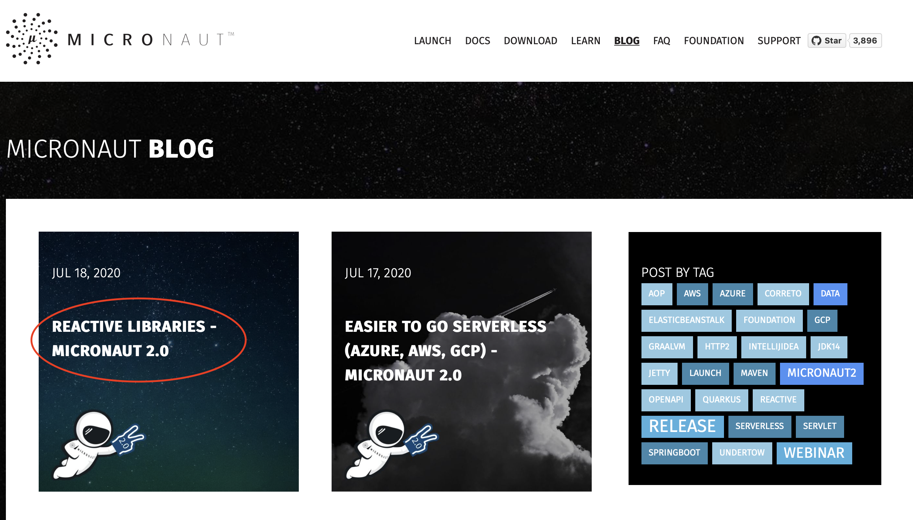
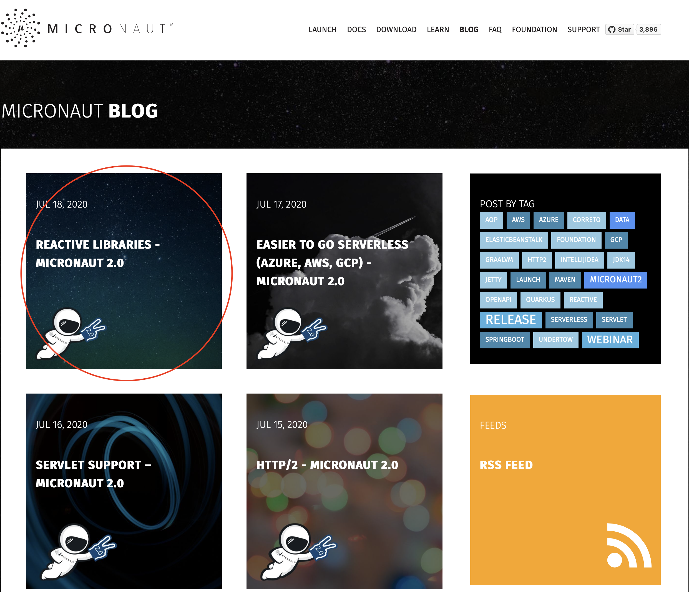

# Micronaut Website

[](https://github.com/micronaut-projects/static-website/actions)

This project builds the Micronaut website. A static website build with [Gradle](https://gradle.org). It uses a Gradle Plugin whose sources can be found at `buildSrc`.

Tasks are grouped with `micronaut`.

You can get more info by running:

```
  % ./gradlew tasks --group=micronaut
 ...
 Micronaut tasks
 ---------------
 buildGuides - Build guides website - generates guides pages, copies assets and generates a sitemap
 cleanDocs - Deletes documentation temp page - build/temp/documentation.html
 cleanDownload - Deletes download temp page - build/temp/download.html
 cleanEvents - Deletes events temp page - build/temp/events.html
 cleanFaq - Deletes faq temp page - build/temp/faq.html
 cleanGuides - Deletes temp Guides page: build/temp/index.html
 copyAssets - Copies css, js, fonts and images from the assets folder to the dist folder
 genDocs - Generates documentation HTML page - build/temp/documentation.html
 genDownload - Generates download HTML page - build/temp/download.html
 genEvents - Generates events HTML page - build/temp/events.html
 genFaq - Generates FAQ HTML - build/temp/faq.html
 genGuides - Generates guides home, tags and categories HTML pages - build/temp/index.html
 genSitemap - Generates build/dist/sitemap.xml with every page in the site
 renderBlog - Renders Markdown posts (posts/*.md) into HTML pages (dist/blog/*.html). It generates tag pages. Generates RSS feed. Posts with future dates are not generated.
 renderSite - Build Micronaut website - generates pages with HTML entries in pages and build/temp, renders blog and RSS feed, copies assets and generates a sitemap
```

## Generating the MAIN site

[https://micronaut.io](https://micronaut.io)

```bash
./gradlew build --console=plain
```

The output can be found in the `build/dist` directory.

## Generating the GUIDES site

[https://guides.micronaut.io](http://guides.micronaut.io)

```bash
./gradlew buildGuide --console=plain

```
The output can be found in the `build/dist` directory.

## Running the website locally

The easiest way to work locally is to generate the site and setup your Webserver to serve build/dist.

For example with [MAMP](https://www.mamp.info/en/mamp/):



You can also use Python to serve the directory:

```
python3 -m http.server 8080 --directory build/dist
```

## Blog Posts

### Posts Location

Write blog posts in markdown at `posts` folder.

### Blog post Metadata

A post supports metadata at the beginning of the document. You can use it store information (title, description, publication date) about your blog posts.

Metadata must be separated from the rest of the document by three dashes.

You can use the metadata in the text by putting it in brackets adding a % sign.

A typical blog post will look like:

```markdown
---
title: Micronaut Is Now Certified to Run on Amazon Corretto
date: April 9, 2020
description: Users can now be assured that Micronaut is certified to run on Amazon Corretto, and we will continue our partnership with Amazon to ensure users don't run into any issues in production.
author: Álvaro Sánchez-Mariscal
---

# [%title]

[%author]

[%date]

Tags: #aws #correto

One practice used by the [Micronaut development team](https://objectcomputing.com/products/2gm-team "Groovy, Grails, and Micronaut Team") is continuous integration (CI). In support of this, the [Micronaut framework](https://micronaut.io/ "Learn more about the Micronaut Framework")'s core has an extensive test suite executed via [GitHub Actions](https://github.com/features/actions), and since the beginning of 2020, tests have also been executed with [Amazon Corretto](https://aws.amazon.com/corretto/) 8 and 11.
```

#### Text Expander snippets

If you write often to Micronaut's blog, we recommend you to create a [Text Expander](https://textexpander.com) snippet:

 


#### Title Metadata

`title` tag is used as the window title, the card title, blog post main header and also in twitter cards.







#### Description Metadata

Description metadata is used as HTML meta description tag, and in twitter cards.

#### Date Metadata

Date is used to for publication date. It is used to order to blog posts. It is displayed in the UI and in the RSS feed.

Date can be expressed in `MMM d, yyyy`

```markdown
---
...
..
.
date: April 9, 2020
---

```

or `MMM d, yyyy HH:mm`

```markdown
---
...
..
.
date: April 9, 2020 09:00
---

```

**To Schedule tasks use a date in the future. Github Action is triggered daily and will publish scheduled posts.**

#### Blog post background

For Blog post background images usage image metadata.

```markdown
---
...
..
.
image: 2018-05-23.jpg
---
```

Place the images at `assets/bgimages`



### Tags

To add tags just preffix them with `#`:

Example:

```markdown
Tags: #aws #correto
```

**Webinars on-demand recordings should be tagged with `webinar`**

Release announcements should be tagged with `release`.

Check the [list of tags](https://micronaut.io/blog/index.html) and try to reuse them. Technology (e.g. GraalVM, Maven, Gradle), Programming concepts (AOP, Serverless, Servlet), Cloud Providers (AWS, GCP, Azure) or frameworks (SpringBoot, Quarkus) are good tags.

#### Code Highlighting

If your blog post, contains code samples add the following metadata:

```markdown
---
...
..
.
CSS: /stylesheets/prismjs.css
JAVASCRIPT: /javascripts/prismjs.js
---

# [%title]

```

#### Video

Use the `video` metadata to embed a Video.

Currently, the plugin supports youtube videos. Use a link which starts with `https://www.youtube.com/watch?v=` such as `https://www.youtube.com/watch?v=RtjSqRZ_md4`

Example:

```markdown
---
title: GOTO 2019 - Introduction to Micronaut
date:  Jul 21, 2020 09:04
description: Graeme Rocher, Micronaut framework co-founder, introduction to Micronaut at GOTO 2019 Conference.
author: Sergio del Amo
video: https://www.youtube.com/watch?v=RtjSqRZ_md4
---

# [%title]

[%author]

[%date]

Tags:

[%description]
```


## Assets (Fonts, Stylesheets, Images, Javascripts)

Assets used in the website can be found under `assets`.

## Page Metadata

 You may also define the meta in Pages. To include multiple js/css files use a single space to separate the file names.

```markdown
---
...
..
.
CSS: /stylesheets/prismjs.css
JAVASCRIPT: /javascripts/prismjs.js /javascripts/other.js
---
<div>...</div>
```

## Page Metadata

You may also define the meta in Pages. To include multiple js/css files use a single space to separate the file names.

```markdown
...
..
.
CSS: /stylesheets/prismjs.css
JAVASCRIPT: /javascripts/prismjs.js /javascripts/other.js
---
<div>...</div>
```

If you want to convert a YML file from the `/conf` folder into a JS object that is injected into the head you may add it similar to how `JAVASCRIPT` is added

```markdown
...
..
.
YAML_CONF_TO_JS: donations.yml
---
<div>...</div>
```

Then the file is available in the other script tags via a underscored cased version of the file name with a `CONF_` prefix

```
var config = window['CONF_DONATIONS']
```


## What to change when a new release is published.

Please, modify `conf/releases.yml`
