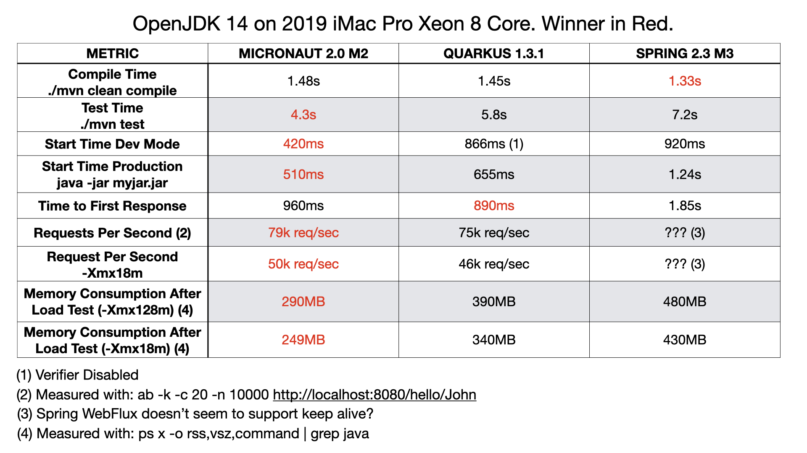

title: Micronaut vs Quarkus vs Spring Boot Performance on JDK 14
date: April 7, 2020  
description: Micronaut vs Quarkus vs Spring Boot Performance on JDK 14
author: Graeme Rocher
---

# [%title]

**By [%author]**

[%date] 

After the recent releases of Micronaut 2.0 M2 and JDK 14, I decided it would be a good time to see what the state of play is performance wise between Micronaut, Quarkus, and Spring Boot on JDK 14 in 2020.

Historically, we have encouraged users to make their own judgments, but recently some incorrect or distorted information has been published, and I think it's important that I clarify some points that may be confusing or misleading. For example, if you search for "Micronaut vs Quarkus" on Google, the first result it serves up is [a blog post](https://simply-how.com/quarkus-vs-micronaut) that contains benchmarking data that none of the Micronaut team has been able to replicate with any recent version of Micronaut on a variety of systems.

So to ensure there is more accurate information out there, and also to show users how to compare these frameworks in an "apples-to-apples" manner (since each framework's default configuration is different), I decided to take for a spin the latest versions of the three most-hyped frameworks among Java developers today: Micronaut, Quarkus and Spring Boot.

Before getting started, we acknowledged that this cannot help but be a somewhat biased analysis, given that Object Computing is the home of Micronaut. To mitigate this bias, we attempted to make the comparison as transparent as possible by performing tests that users can replicate at home, and to conduct them live in a completely unedited screencast. You can watch that screencast here:

For reference, the source code for the examples built during the recording of this screencast can be [found on Github](https://github.com/graemerocher/framework-comparison-2020).

## Summary of Results

Following are the stats that were produced during the recording of this screencast for the different metrics we tested (winner in red), taking the averages over 10 runs:

###### UPDATE

The response from the Spring team was to use [wrk](https://github.com/wg/wrk) or [vegata](https://github.com/tsenart/vegeta) to benchmark instead. Quarkus appears to be the winner at higher concurrency when testing with wrk whilst Micronaut appears to be the winner with vegata. This proves once again do your own benchmarking with a variety of tools!

###### END UPDATE

As you can see, as of today, if you are looking at performance, Quarkus is marginally ahead on time to first response (around 70ms), while the only metric Spring Boot wins is compilation time due to not doing any compilation-time processing.

With regard to Spring Boot, we were unable to extract reliable request-per-second data because Spring's Netty implementation bizarrely doesn't seem to support keep-alive connections correctly. Of course this may be something that we are doing wrong on our side, so please feel free to leave a comment on the video if any Spring users know the solution.

The Quarkus team has made bold claims about the memory efficiency of Quarkus, so it was surprising to see such a disparity when actual tests were conducted that seem to disprove these claims. The Micronaut team and I are disappointed that we had to take it upon ourselves to perform these tests and publish the results, not as a simple opportunity to help others improve their processes and applications, but to respond to misinformation that could, theoretically, do the opposite. 

We are all extremely proud of Micronaut, and we know users have been happy with its powerful capabilities. We listen to feedback and work every day on making improvements that we hope will help even more people enhance their productivity and build faster, better apps. That said, I encourage all users to do their own testing and make their own judgments regarding which JVM framework they prefer.