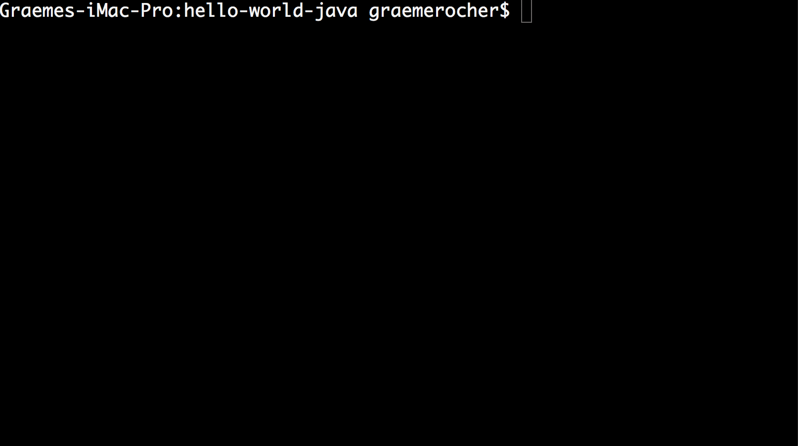

# [%title]

[%author]

[%date] 

Tags: #release #openapi #graalvm

Today, it is with great pleasure that the team at [Object Computing, Inc.](https://objectcomputing.com/) (OCI) announces the release of Micronaut 1.0 RC1.

Over a year in the making, Micronaut represents a significant step forward in microservice frameworks for the JVM, by supporting all of the features Java developers know and love, such as dependency injection (DI) and aspect-oriented programming (AOP), without making compromises on startup time, performance, and memory consumption.

Micronaut 1.0 is now feature complete (see the [user guide](https://docs.micronaut.io/1.0.x/guide/index.html#whatsNew) for a summary of what's new in the RC) and, more than any other prior milestone release, this RC demonstrates clearly the advantage Micronaut has when it comes to ahead-of-time (AOT) compilation over traditional Java frameworks. 

## Reflection and Making Java Frameworks More Efficient

The Java reflection API has been around a long time and is used extensively by libraries and frameworks throughout the Java ecosystem.

The majority of modern frameworks use a reflection-based approach to invoke endpoints, create proxies, perform data binding, read configuration, and so on. It is quite remarkable how much dynamic, reflection-based logic exists in a typical modern Java application, given that the language itself is statically typed.

Unfortunately, using the reflection API comes with some significant costs, both in terms of memory and runtime performance, including the following:

*   Because there is no common reflection cache in Java, and reading reflective data is expensive, each library and framework produces a unique reflection cache. In a typical modern Java application, you will find Spring has a unique cache, Groovy has another cache, Jackson another, and so on. This makes it extremely difficult to optimize memory consumption.
*   Reflective calls are much more difficult for the JIT to optimize. Efforts such as InvokeDynamic and others try to alleviate this situation, but reflective calls will never be as efficient.
*   Most frameworks are not aware of the diverse language eco-ystem on the JVM. Languages such as Groovy and Kotlin produce more methods at the byte code level than Java does to support the additional language features they provide. This difference means that reflection caches are often larger for Groovy- and Kotlin-based classes, since the byte code contains more methods, fields, and so on.

One of the key goals we set out to achieve when developing Micronaut was to enhance Java's efficiency and make it viable and possible to run applications that contain no compromises in terms of modern framework features but occupy 10s of megabytes of memory instead of 100s of megabytes.

Although Micronaut has many features that are undeniably beneficial to the creation of microservices, Micronaut is, in fact, a general purpose framework that can be used to build a range of applications, from CLI applications, to functions that run in the cloud, to scheduled jobs that process data from Kafka.

Micronaut features a custom-built [DI](https://docs.micronaut.io/1.0.x/guide/index.html#ioc) and [AOP model](https://docs.micronaut.io/1.0.x/guide/index.html#aop) that _does not_ use reflection.

Instead, an abstraction over the Java annotation processor API (APT) and Groovy AST enable developers to build efficient applications without giving up features they know and love.

This approach has opened doors to myriad framework features that are more easily achieved with AOT compilation and that are unique to Micronaut.

## Feature 1: GraalVM Native Image Support

[GraalVM](https://www.graalvm.org/) is a new universal virtual machine from Oracle that includes a polyglot runtime and a unique feature that allows compiling Java applications into a native image.

Due to Micronaut's compile-time, reflection-free approach to DI and AOP, you can natively compile a Micronaut application into a GraalVM native image, allowing the application to start up in milliseconds while consuming only a fraction of the memory of a regular Java application running on the JVM.

Check out this little animation demonstrating the feature in action:



With a GraalVM native image, Micronaut's startup time drops from around 1 second to around 20ms, while memory consumption drops from around 60mb (most of which is occupied by the JVM) to around 20mb for the native process.

Although GraalVM does have ways to activate support for traditional reflection, these are unwieldy and sub-optimal. Micronaut provides out-of-the-box support for building GraalVM-compatible applications without the developer having to have deep knowledge of which classes require reflection and which do not.

See the section on [GraalVM and Micronaut](https://docs.micronaut.io/1.0.x/guide/index.html#graal) in the user guide for more information on this feature. 

## Feature 2: Compilation-Time Support for Swagger (OpenAPI)

Micronaut 1.0 includes [compile-time support for Swagger](https://docs.micronaut.io/snapshot/guide/index.html#openapi), the industry standard tool for describing APIs. The majority of frameworks that integrate [Swagger](https://swagger.io/) do so at runtime, using extensive reflection-based approaches that are problematic from both a performance and a memory-consumption perspective.

Micronaut features a [comprehensive, language-neutral visitor API](https://docs.micronaut.io/1.0.x/api/io/micronaut/inject/visitor/package-summary.html) that allows developers to perform compile-time analysis without depending directly on Groovy's AST or Java's APT. The Swagger support in Micronaut builds on this feature.

For example, consider this simple "hello world" example:

```
@Controller("/")
@Validated
public class HelloController {
    @Get(uri="/hello/{name}", produces="text/plain")
    public Single<String> hello(@NotBlank String name) {
        return Single.just("Hello " + name + "!");
    }
}
```

Once configured, Micronaut will at compile time build the appropriate Swagger YAML which can easily be added as a static resource that can then be imported into the [Swagger UI](https://github.com/swagger-api/swagger-ui) (a React / Node application) without needing any additional runtime reflection in your Java code:

```
paths:
  /hello/{name}:
    get:
      operationId: hello
      parameters:
      - name: name
        in: path
        required: true
        explode: false
        schema:
          type: string
      responses:
        default:
          content:
            text/plain:
              schema:
                type: string
```

## Feature 3: Compile-Time Validation

All modern Java frameworks include a bunch of inherit rules that you as a developer cannot violate, and while languages like Java provide you with compile-time checking mechanisms to confirm that your code is correct, most modern frameworks do not, relying instead on runtime exceptions to inform the user that his or her code is wrong.

In fact a [common criticism](https://blog.softwaremill.com/the-case-against-annotations-4b2fb170ed67) leveled at annotation-based programming models among static-compilation fans is the dynamic references you have to place in the annotations that are not statically checked. 

Although these issues have not prevented annotation-based programming models from becoming the most popular among Java developers, they can lead to a frustrating experience. This was something we wanted to address in the design of Micronaut.

Let's take an example, consider the following simple route definition:

```
@Get("/hello/{name}")
public Single<String> hello(@NotBlank String na) {
     return Single.just("Hello " + na + "!");
}
```

Spot the obvious typo?

The route defines a variable called `name`, but the method accepts a parameter called `na`. With the majority of modern frameworks, this will lead to a runtime error.

But not with Micronaut:

```
hello-world-java/src/main/java/example/HelloController.java:34: error: The route declares a uri variable named [name], but no corresponding method argument is present
    public Single<String> hello(@NotBlank String na) {
                          ^
```

This feature is powered by Micronaut's extensive support for compile-time visitors that validate you are using the framework correctly and provide early feedback to obvious framework-related problems in your code.

In addition, this checking mechanism works whether you are a Java, Kotlin, or Groovy developer. Micronaut's abstraction across language ASTs ensures a consistent experience regardless of which language you choose.

## Feature 4: Mapping Annotations at Compile Time

The approach we took in the design of Micronaut necessitated the creation of a new set of Java annotations enhanced to trigger AOT compilation.

Unlike traditional Java frameworks, such as Java EE (now Jakarta EE) and Spring, that perform analysis of framework-level annotations at runtime, Micronaut performs this same analysis but at compilation time, allowing startup performance to be faster (particularly as your application grows) and memory consumption to be significantly lower.

There are, however, a number of excellent specifications and standards in the Java space that developers are already comfortable with; it made sense to support these in Micronaut. Thanks to Micronaut's extensive annotation metadata, you can map the values of any annotation to the values of any other annotations at compile time using an AnnotationMapper.

What this means in practice is Micronaut can support annotations such as `javax.annotation.security.RolesAllowed` for security or `javax.persistence.PersistenceContext` for injecting a JPA `EntityManager`.

The API for this is trivial; the following example is taken from `RolesAllowedAnnotationMapper`:

```
public List<AnnotationValue<?>> map(AnnotationValue<RolesAllowed> annotation) {
    String[] values = annotation.get("value", String[].class).orElse(new String[0]);

    List<AnnotationValue<?>> annotationValues = new ArrayList<>(1);
    annotationValues.add(
            AnnotationValue.builder(Secured.class)
                            .values(values)
                            .build()
    );
    return annotationValues;
}
```

As you can see, line 1 receives the annotation being mapped and is able to return one or many new annotations that map to an internal framework feature (in this case, security).

We anticipate supporting more standard Java annotations in the future using this feature.

## Summary

We are extremely excited about Micronaut 1.0 and believe it is at the forefront of the growing movement towards AOT compilation in the Java space.

AOT compilation is the next big innovation coming to Java frameworks because it allows Java applications to be optimally built for scenarios such as low-memory footprint microservices, IoT (yes Micronaut runs on the Raspberry Pi), serverless, and so on.

Whether you are building a client or a server, a scheduled job or a stream processing application, Micronaut has a compelling set of features that you can introduce without paying the heavy cost associated with most current Java frameworks.

The release of 1.0 RC1 is just the start, and we have a lot more coming on the roadmap, including better integration with Grails. The response we have had from the enthusiastic Micronaut user community has been outstanding, and we look forward to hearing feedback as we approach the final GA release in the next few weeks.
