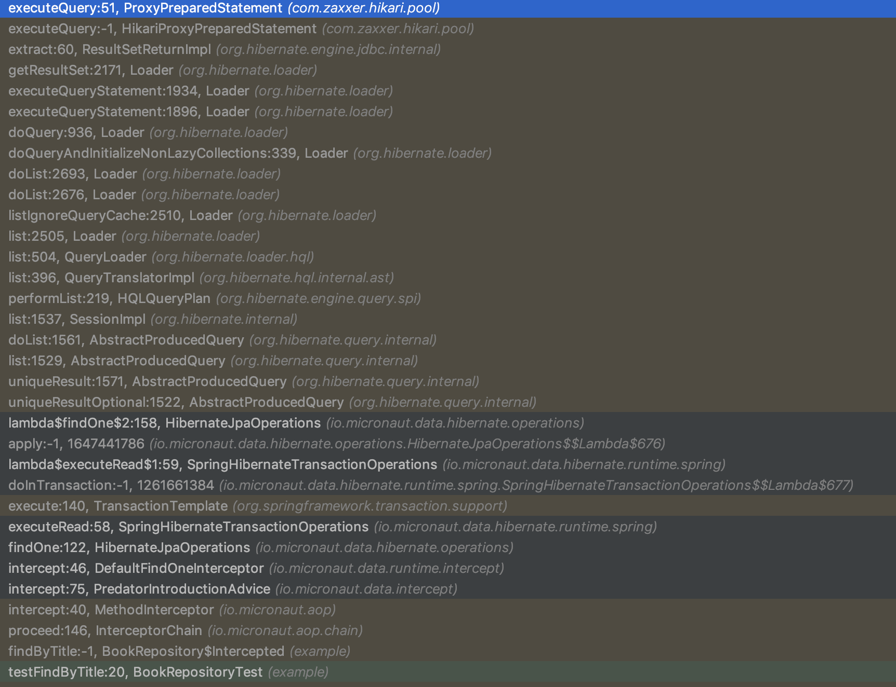

# [%title]

[%author]

[%date]

Tags: #data

Today, the [Micronaut team](https://objectcomputing.com/products/2gm-team) at [Object Computing, Inc.](https://objectcomputing.com/) (OCI) unveiled [Micronaut Data](https://github.com/micronaut-projects/micronaut-data) (previously known as Predator), a brand new Open Source project that aims to dramatically improve the runtime and memory performance of data access repository logic for the microservice and serverless era, while also maintaining the productivity benefits of tools like [GORM](https://gorm.grails.org) and [Spring Data](https://spring.io/projects/spring-data).

## History of Data Access Toolkits

The data repository pattern can be traced back to 2004, when Ruby on Rails debuted with a feature called ActiveRecord — an API that revolutionized data access from a productivity perspective.

In 2007, the Grails team brought an ActiveRecord-like API to the JVM for the first time with the creation of GORM (part of Grails). GORM relied on the dynamic nature of the Groovy language to implement finder methods on top of Hibernate and provided the same productivity benefits for JVM users.

Due to GORM's reliance on the Groovy language, Spring Data was created in 2011 to address the need for Java users, allowing finder methods like `findByTitle` to be defined in an interface and the query logic to be implemented automatically at runtime.

## How Data Access Toolkits Work

All of these implementations use the same general pattern, which is to construct a meta-model of the entities in a project _at runtime_ that models the relationships between your entity classes. In Spring Data, this is the [MappingContext](https://docs.spring.io/spring-data/commons/docs/current/api/org/springframework/data/mapping/context/MappingContext.html), and in GORM, this is also called the [MappingContext](http://gorm.grails.org/latest/api/org/grails/datastore/mapping/model/MappingContext.html). They are constructed by scanning entity classes and analyzing the classes via reflection. (The naming similarity here is no coincidence. In 2010, I worked with the Spring Data team to try and fork GORM into something for Java, a project which eventually evolved into what is Spring Data today.)

This meta-model is then used to translate a finder expression like `bookRepository.findByTitle("The Stand")` into an abstract Query model at runtime using a combination of regular expression pattern matching and custom logic. The abstract Query model is needed, since the target query dialect differs for each database (SQL, JPA-QL, Cypher, Bson etc.).

## Data Repository Support and Micronaut

Since we launched Micronaut just over a year ago, the number one feature users have asked us for is "GORM for Java" or Spring Data Support. So many developers love the productivity experience that these toolkits provide, as well as the ease of simply defining an interface that the framework implements. I would go so far as to say a big part of Grails' and Spring Boot's success can be attributed to GORM and Spring Data respectively.

For Groovy users of Micronaut, we have had GORM support from day one, which left Java and Kotlin users needing to roll their own repository implementations.

It would have been technically possible, and frankly easier, to simply add a Micronaut module that configured Spring Data. However, by going down that path, we would have introduced a feature that is implemented in a manner using all the techniques Micronaut has tried to avoid: extensive use of runtime proxies, reflection, and high memory consumption.

## Introducing Micronaut Data

Micronaut Data uses Micronaut's ahead-of-time (AoT) compilation APIs to move the entity meta-model into your compiler and translate a finder expression like `findByTitle` into the appropriate SQL or JPA-QL query _at compilation time_. A very thin runtime layer that uses Micronaut's reflection-free compilation-time AOP then only has to execute the query and return the results.

The result is staggering ... significantly reduced cold starts, astonishingly lean memory consumption, and dramatically improved performance.

Today, we are open sourcing Micronaut Data under the Apache license, and it comes with two initial implementations (with more planned for the future) for JPA (using Hibernate) and for SQL with JDBC.

The JDBC implementation is the one I am most excited about, as it completely eliminates reflection, runtime proxies, and dynamic classloading for your persistence layer and results in massive performance gains. The runtime layer is so light that even an equivalent repository method written by hand would not execute faster.

## Micronaut Data Performance

Since Micronaut Data does not have to do any query translation at runtime, the performance gain is significant. In a world of utility cloud computing, where billing models are changing such that you pay for the amount of time your application is running or the execution time of an individual function, developers often overlook the performance of their data access toolkits.

The following table summarizes the performance difference you can expect for a finder expression, such as `findByTitle`, when compared to other implementations. All benchmarks were carried out using test hardware of an 8-core Xeon iMac Pro under the same conditions, are Open Source, and can be [found in the repository](https://github.com/micronaut-projects/micronaut-data):

|Implementation|Operations per Second|
|--- |--- |
|Micronaut Data JDBC|225K ops/sec|
|Micronaut Data JPA|130K ops/sec|
|Spring Data JPA|90K ops/sec|
|GORM JPA|50K ops/sec|
|Spring Data JDBC|Finders Not Supported|

Yes, you read that right. With Micronaut Data JDBC, you can expect nearly 4X the performance of GORM and 2.5X the performance of Spring Data.

If you go with Micronaut Data JPA, even then, you can expect more than 2X the performance of GORM and up to 40% better performance than Spring Data JPA.

* * *

###### UPDATE SEPTEMBER 2, 2019

Since this post was written both Micronaut Data and Spring Data have been further optimized and the latest result data on the same test hardware is as follows (Note the Spring Data JDBC numbers use a hard coded query):

|Implementation|Operations per Second|
|--- |--- |
|Micronaut Data JDBC|430K ops/sec|
|Micronaut Data JPA|145K ops/sec|
|Spring Data JPA|140K ops/sec|
|GORM JPA|50K ops/sec|
|Spring Data JDBC|275K ops/sec|

###### END UPDATE

* * *

Micronaut Data is able to achieve such a significant performance jump for a variety of reasons, from the elimination of reflection to the much thinner runtime component. One reason, however, is pretty simple to identify: Stack Traces.

Take a look at the difference in Stack Trace size when using Micronaut Data compared to the alternatives:

#### Micronaut Data JDBC


#### Micronaut Data JPA


#### Spring Data JPA


#### GORM


Micronaut Data JDBC produces only 15 stack frames until your query is actually executed, while Micronaut Data JPA produces 30 (mainly Hibernate frames), compared to 50+ stack frames for Spring Data or GORM, all thanks to Micronaut's reflection-free AOP layer.

Shorter stack traces also result in easier-to-debug applications. One of the benefits of doing most of the work at compile time is that errors can be detected at compile time, greatly improving the developer experience by providing immediate compilation errors instead of runtime errors for many common mistakes.

## Micronaut Data Compile-Time Checking

Most repository implementations rely exclusively on doing all the computation at runtime. This means that if the user makes any mistakes when defining the repository interface, they are not caught until the application is actually running.

This removes some of the type checking benefits of Java and provides a poor developer experience. With Micronaut Data, that is not the case. Consider the following example:

```java {.line-numbers} {highlight=3}
@JdbcRepository(dialect = Dialect.H2)
public interface BookRepository extends CrudRepository<Book, Long> {
    ==Book findByTile(String t);==
}
```

Here the `BookRepository` is attempting a query on an entity called `Book` that has a property called `title`. Unfortunately, the finder has a typo, in that it is `findByTile` instead of `findByTitle`. Instead of waiting until runtime to inform the user of this fact, Micronaut Data will fail at compilation time with an informative error message:

```text {.line-numbers}
Error:(9, 10) java: Unable to implement Repository method:
BookRepository.findByTile(String title). Cannot use [Equals] criterion on non-existent property path: tile
```

Many aspects of Micronaut Data are compilation-time checked whenever possible to ensure that if an error does occur at runtime, it is not due to a typo in a repository definition.

## Micronaut Data JDBC and GraalVM Substrate

Another reason to be excited about Micronaut Data JDBC is that it is compatible out-of-the-box with GraalVM Substrate native images without needing complex, byte-code-mutating build-time enhancement solutions, like those required to get Hibernate operational on GraalVM.

By completely eliminating all reflection and dynamic proxies from the persistence layer, Micronaut Data hugely simplifies getting applications that access data running on GraalVM.

The Micronaut Data JDBC example application included in the repository runs without problem in Substrate and produces a significantly smaller native image (25MB smaller!) than what is required to pull in Hibernate, thanks to the much thinner runtime layer.

We saw the same result when we implemented compilation time computation of bean validation rules for Micronaut 1.2\. The native image size dropped by 10MB by removing the dependency on Hibernate Validator and the JAR file size by 2MB.

The advantage here is clear: By doing more work during compilation and creating leaner runtimes, you produce smaller native images and JAR files, which results in smaller and easier-to-deploy microservices when deployed via Docker images. The future of frameworks for Java is more powerful compilers and smaller, lighter runtimes!

## Micronaut Data and the Future

We are just getting started with Micronaut Data, and we are crazy-excited about the possibilities it opens up.

Initially, we are launching with support for JPA and SQL, but you can expect support for MongoDB, Neo4j, Reactive SQL, and other databases in the future. Thankfully, doing this work is a lot simpler because much of Micronaut Data is actually based on a fork of the GORM source code, and we will be able to reuse logic from GORM for Neo4j and GORM for MongoDB to get those implementations ready sooner than you may expect.

Micronaut Data is the culmination of putting together various building blocks in Micronaut Core that made it possible, from the AoT APIs, which are also used to [generate Swagger documentation](https://github.com/micronaut-projects/micronaut-openapi), to the relatively new [Bean Introspection support](https://docs.micronaut.io/latest/guide/index.html#introspection), which allows introspection of beans at runtime without using reflection.

Micronaut provides the building blocks to do some amazing things. Micronaut Data is one those things, and we are just getting started on delivering on some of the promising foundations delivered in Micronaut 1.0.
