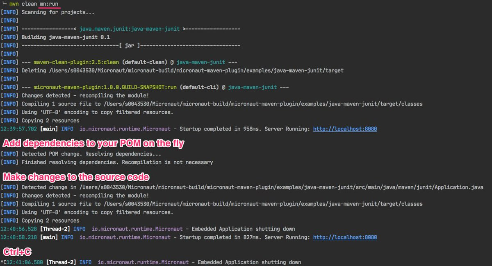

title: Micronaut 2.0 Milestone 2: Massive Maven Improvements
date: Apr 2, 2020  
description: Micronaut 2.0 Milestone 2 release announcement
author: Graeme Rocher
image: 2020-04-02.jpg
---

# [%title]

[%author]

Tags: #maven

[%date] Just two weeks since the last milestone, the [Micronaut team](https://objectcomputing.com/products/2gm-team) at [Object Computing, Inc.](https://objectcomputing.com/) (OCI) is pleased to announce [Micronaut 2.0 Milestone 2](https://github.com/micronaut-projects/micronaut-core/releases/tag/v2.0.0.M2).

Beyond the features [already introduced in Milestone 1](/blog/2020-03-20-micronaut-20-milestone-1-released.html), the second milestone features the following three additional themes.

## A Love Letter to Maven Users

The Micronaut team loves Gradle; hence it's the default build system for new Micronaut projects. However, Maven usage is huge, and Maven is great too, so we wanted to make sure Maven users have a great experience with Micronaut, as well.

We have always supported building with Maven by using `mn create-app myapp --build maven` to create your application. Now however, thanks to the great work of Alvaro Sanchez-Mariscal of the Micronaut team, we are happy to introduce the [Micronaut Maven Plugin](https://micronaut-projects.github.io/micronaut-maven-plugin/latest/), as well as new parent POMs for Maven projects.

With the Micronaut Maven plugin, you can run your Micronaut application and have changes instantaneously reloaded:

In addition to this awesomeness, a new `micronaut-parent` POM is published that users can include as a parent to any `pom.xml` file. This will automatically configure the Micronaut Maven plugin.

## New Reactive Modules

Thanks to the Reactive Streams specification, there are a whole bunch of reactive libraries out there that work well with Micronaut. In addition, newer libraries are coming out all the time, including [RxJava 3](https://github.com/ReactiveX/RxJava/wiki/What%27s-different-in-3.0).

Micronaut 2.0 comes with new [reactive modules](https://docs.micronaut.io/2.0.x/guide/index.html#reactiveConfigs) that you can add to your classpath that allow you to choose between RxJava 1, RxJava 2, RxJava 3, and Reactor.

## Significant Startup Improvements

We have continued to make improvements that make Micronaut more and more useful for serverless use cases. For example, you now have the ability to eagerly initialize beans on AWS Lambda, and we've improved Micronaut's overall startup time by between 20% and 30% over Micronaut 1.x

## More to Come

Micronaut 2.0 Milestone 2 follows hot in the heels of M1, and we're not done yet! Expect big improvements to Micronaut's serverless support in the next milestone before we start with the RC stage.

Thanks to the community for your great contributions so far; your input helped make this release happen. Enjoy!
