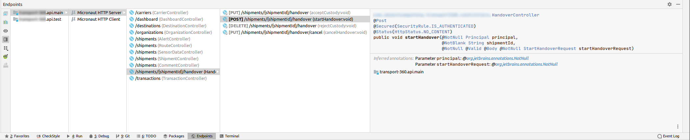
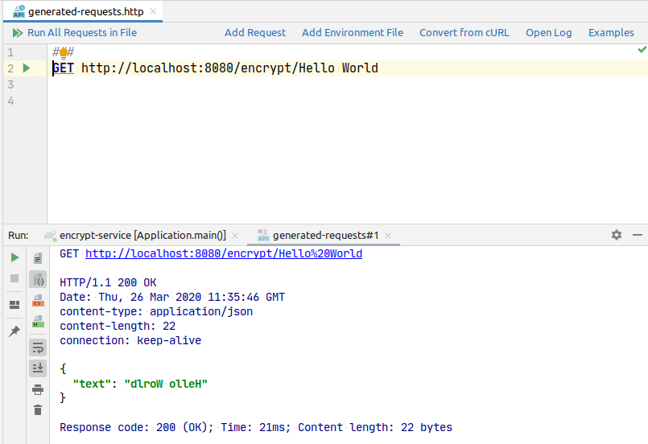
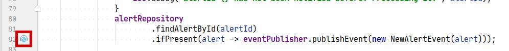
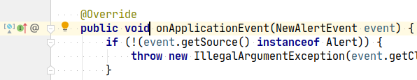

title: 5 Reasons You'll ❤️ Using Micronaut and IntelliJ IDEA to Boost Your Productivity
date: Apr 16, 2020 
description: Here are five specific features that make the Micronaut IntelliJ IDEA combo a terrific tool for any developer looking to boost his or her productivity.
author: Iván López
image: 2020-04-16.png
CSS: https://micronaut.io/stylesheets/prismjs.css
JAVASCRIPT: https://micronaut.io/javascripts/prismjs.js
---

# [%title]

[%author]

[%date] 

Tags: #intellijidea

I have been using IntelliJ IDEA for the last six or seven years, and I am always eager to experiment with new features when updated versions are released. When I heard a couple of months ago that JetBrains had introduced Micronaut support in IntelliJ IDEA 2020.1 EAP, I didn't think twice; I downloaded it and started using it in my current project.

In this blog post, I'll share the five features I like most and how they can help you improve your productivity when building Micronaut applications with IntelliJ IDEA.

## 1\. Configuration Auto-Completion

Micronaut has published files containing the meta information for the configuration properties since 1.0\. This file is generated automatically at compile time for any class annotated with `@ConfigurationProperties` or `@EachProperty`.

With this feature, you get auto-completion of the configuration properties in `application.yml`.

This works not only for Micronaut itself, but for any configuration that you define in your own application.

For example, with the following [immutable configuration](https://docs.micronaut.io/latest/guide/index.html#immutableConfig) in your project ...

```java
@ConfigurationProperties("my.engine")
public interface EngineConfig {

    /**
     * @return The manufacturer name.
     */
    @Bindable(defaultValue = "Ford")
    @NotBlank
    String getManufacturer();

    @Min(1L)
    int getCylinders();

    @NotNull
    CrankShaft getCrankShaft();

    @ConfigurationProperties("crank-shaft")
    interface CrankShaft {
        Optional<Double> getRodLength();
    }
}
```

… you get these auto-completions.

Even the default values for the properties and the javadoc comments are displayed.


## 2\. Endpoints Discovery

You're likely to find it really helpful to have a clear picture of all the endpoints in your application. You can click on the “Endpoint” button at the bottom of the screen to activate it. 

There are a few configuration options to display exactly what you would like to see. These options include showing the endpoints from the framework (like management endpoints if you have them), grouping by client/server, and much more! 

Additionally, if you double-click on an endpoint, the controller method is opened in the editor.



## 3\. Controllers and HTTP Requests

When interacting with our Micronaut applications, sometimes we use tools like `curl` to send HTTP requests. This is fine, but it means we must go "out" of our IDE, and we lose some of the features and shortcuts we're used to.

Let's imagine we have an encryption-service that receives some text and encrypts it. To make things simple, the encryption logic in the `EncryptionService` just reverses the string:


If we click on the icon in the gutter, IntelliJ IDEA automatically generates an "http-requests" file with the endpoint set and ready to send a test request:



Take a look at the examples to see how to customize the requests, define authentication, and other useful tasks.

## 4\. Event Publishing and Listeners

Sometimes we publish an event in our applications when something happens, and then we subscribe for that event in other parts of the code. But you may find it tricky to know exactly when that happens.

Not anymore! 

Clicking on this new icon in the gutter navigates to the listener:





## 5\. Miscellaneous

Besides the things I've already highlighted, other new features include new icons in the gutter, navigation to services injected as constructor arguments, and more.

## Looking Ahead

The Micronaut team has been extremely pleased with the superb efforts JetBrains has made in incorporating support for Micronaut into IntelliJ IDEA.

I'm really looking forward to [support for Micronaut Data](https://youtrack.jetbrains.com/issue/IDEA-222224) in a future IntelliJ IDEA release.
