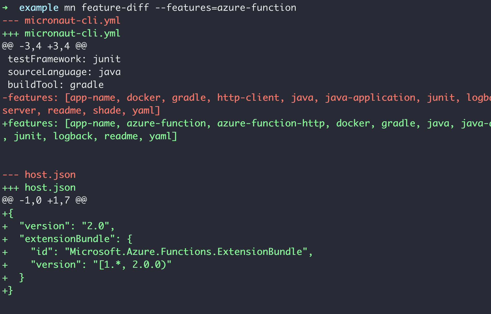
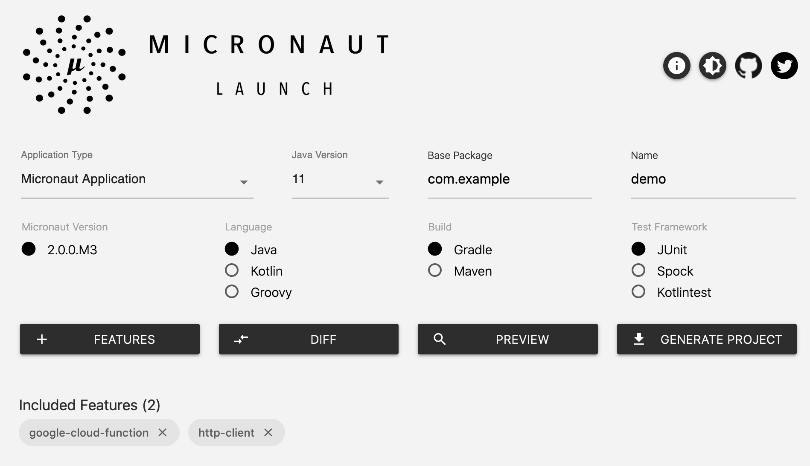

# [%title]

[%author]

[%date] 

Tags: #launch

With the release of [Micronaut 2.0 M3](/blog/2020-04-30-micronaut-20-m3-big-boost-serverless-and-micronaut-launch.html), we have gone live with a brand new implementation of the Micronaut command line interface (CLI) and [Micronaut Launch](https://micronaut.io/launch/), an online tool for creating Micronaut applications.

##  A CLI History

When Micronaut was first being developed, we knew we needed a tool to generate applications that allowed users to get up and running writing code without having to worry about how to configure their builds and what the dependency coordinates are. Because Micronaut relies on compile-time processing, the build setup can be slightly more complicated than a simple Java application.

Grails has a CLI that allows users to do just that, so we decided to fork it and copy the code into the Micronaut project. This allowed us to create a CLI with only a small amount of time required on our end to get working.

Over time, we discovered that the forked CLI could not meet Micronaut's needs. The Grails CLI was designed to create Groovy applications built with Gradle and tested with the Spock testing framework. Because Micronaut currently supports all combinations of Java/Groovy/Kotlin, Junit/Spock/KotlinTest, and Maven/Gradle, the number of combinations is significantly greater than what the original CLI was designed to handle.

In addition, the old CLI had several other shortcomings that we wanted to address:

- Difficult to test
- Problematic to embed
- Hard to produce a GraalVM native image
- Hard to customize

## Leveling Up the CLI

For Micronaut 2.0, we decided it was time to rewrite the CLI in Micronaut itself (eating your own dog food, if you like) using [PicoCLI](https://picocli.info/). We also wanted to make it possible for the CLI to be deployed to more environments than just the user's terminal.

So with that, we created [Micronaut Launch](https://github.com/micronaut-projects/micronaut-starter), which is now one of the coolest projects in the Micronaut ecosystem.

Micronaut Launch features a [core written in Micronaut itself](https://github.com/micronaut-projects/micronaut-starter/tree/master/starter-core) and a [micronaut-cli module that targets the user's command line](https://github.com/micronaut-projects/micronaut-starter/tree/master/starter-cli) and uses PicoCLI.

The `micronaut-cli` module uses [GraalVM Native Image](https://www.graalvm.org/docs/reference-manual/native-image/) to allow us to produce distributions of the CLI that target [Linux, MacOS, and Windows natively](https://github.com/micronaut-projects/micronaut-starter/releases/tag/v2.0.0.M3).

Using the new CLI, you can create Micronaut applications offline or in areas of limited connectivity using a distribution that suits your platform, and thanks to GraalVM Native Image, it is lightning fast.

The new CLI features more or less the same commands as Micronaut's old CLI, but is much more optimized and fully operable offline. We have also added a few new features, with one of the coolest being the ability to display a diff of the changes required to add a new feature to an existing application:

## The Micronaut Launch API

To allow users to create Micronaut applications via the web without installing the CLI, a [starter-api module](https://github.com/micronaut-projects/micronaut-starter/tree/master/starter-api) was created that [defines the API](https://launch.micronaut.io/swagger/views/swagger-ui/index.html) and uses [Micronaut's compilation-time OpenAPI (Swagger) specification generation](https://github.com/micronaut-projects/micronaut-openapi/).

The `starter-api` module is then used in a number of different subprojects to allow running the API on different environments, including:

- [starter-web-netty](https://github.com/micronaut-projects/micronaut-starter/tree/master/starter-web-netty). A Netty module that is computed into a GraalVM native image and [continuously deployed by Github Actions](https://github.com/micronaut-projects/micronaut-starter/actions?query=workflow%3A%22Snapshot+Analytics+to+GCR%22) to  [Google Cloud Run](https://cloud.google.com/run") and powers [https://launch.micronaut.io](https://launch.micronaut.io) as a serverless application
- [starter-aws-lambda](https://github.com/micronaut-projects/micronaut-starter/tree/master/starter-aws-lambda) A [Lambda version of the API](https://cn58jiuova.execute-api.us-east-1.amazonaws.com/staging/application-types) that is [continuously deployed](https://github.com/micronaut-projects/micronaut-starter/actions?query=workflow%3A%22Snapshot+to+AWS+Lambda%22) to [AWS Lambda](https://aws.amazon.com/lambda/) and runs as a GraalVM native image using a custom runtime

- [starter-gcp-function](https://github.com/micronaut-projects/micronaut-starter/tree/master/starter-gcp-function) A [Cloud Function version of the API](https://us-central1-micronaut-projects.cloudfunctions.net/micronaut-starter-staging/application-types) that is [continuously deployed](https://github.com/micronaut-projects/micronaut-starter/actions?query=workflow%3A%22Snapshot+to+GCF%22) to [Google Cloud Function](https://cloud.google.com/functions) as a serverless application using [Micronaut 2.0's new support for Cloud Function](https://micronaut-projects.github.io/micronaut-gcp/2.0.x/guide/#cloudFunction)
- [starter-azure-function](https://github.com/micronaut-projects/micronaut-starter/tree/master/starter-azure-function) An [Azure Function version of the API](https://micronaut-starter.azurewebsites.net/api/application-types) that is [continuously deployed](https://github.com/micronaut-projects/micronaut-starter/actions?query=workflow%3A%22Snapshot+to+Azure+Function%22) to [Microsoft Azure Function](https://azure.microsoft.com/en-us/services/functions/) as a serverless application using [Micronaut 2.0's new support for Azure Function](https://micronaut-projects.github.io/micronaut-azure/1.0.x/guide/#azureFunction)
- [starter-web-servlet](https://github.com/micronaut-projects/micronaut-starter/tree/master/starter-web-servlet) A version of the API that can be built into a WAR file and deployed on your favorite Servlet 4+ container using [Micronaut 2.0's new support for Servlet containers](https://micronaut-projects.github.io/micronaut-servlet/1.0.x/guide/).

It is a testament to Micronaut 2.0's flexibility that you can take the same application and run it across serverless platforms (Lambda, Azure, Cloud Function, Cloud Run) and also build a regular Netty or Servlet application from the same codebase.

It also provides users maximum flexibility if they wish to run their own version of Micronaut Launch for internal teams since you can now choose whichever platform (Serverless or not) that suits your needs to deploy Micronaut&nbsp;Launch to.

Using GraalVM Native Image, we were able to achieve average response times for a cold start of around 1.5s on Lambda and Cloud Run (billed duration of +/- 600ms for a cold start on Lambda and under a 100ms once warm), which is pretty awesome by Serverless standards.

The API is also accessible via CURL using <a href="https://launch.micronaut.io">https://launch.micronaut.io</a>

## The Micronaut Launch UI

The Micronaut Launch UI is written in [React](https://github.com/micronaut-projects/static-website/tree/master/main/src/main/js/start)</a> and demonstrates the power of the Micronaut community. Our thanks go out to [Francisco Javier Delgado Vallano](https://twitter.com/franvallano), and [Miguel Ángel Quintanilla](https://twitter.com/maq_dev) from [Profile](https://profile.es") in Spain, who built the first version of the UI based on the [OpenAPI specification](https://launch.micronaut.io/swagger/views/swagger-ui/index.html) we provided:

The Micronaut Launch UI includes some awesome features such as:

- Support for generating Micronaut applications, functions, CLI applications, and gRPC applications
- The ability to preview the application that will be generated
- The ability to show a diff for a given feature to see what changes are made to an application when a feature is applied
- And of course, Dark Mode!

## Summary

Micronaut Launch is a fantastic example of modern application development using Micronaut. The application leverages GraalVM Native Image to optimize both the CLI for each platform and the API in order to fully take advantage of GraalVM's outstanding cold start performance for CLI applications and Serverless.

Micronaut Launch also utilizes several of the great features we are building in Micronaut 2.0 including improved support for Serverless platforms such as AWS Lambda, Google Cloud Function, and Azure Function.

[Let us know what you think](https://github.com/micronaut-projects/micronaut-starter/issues)!
