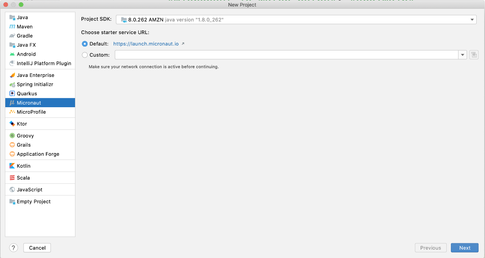
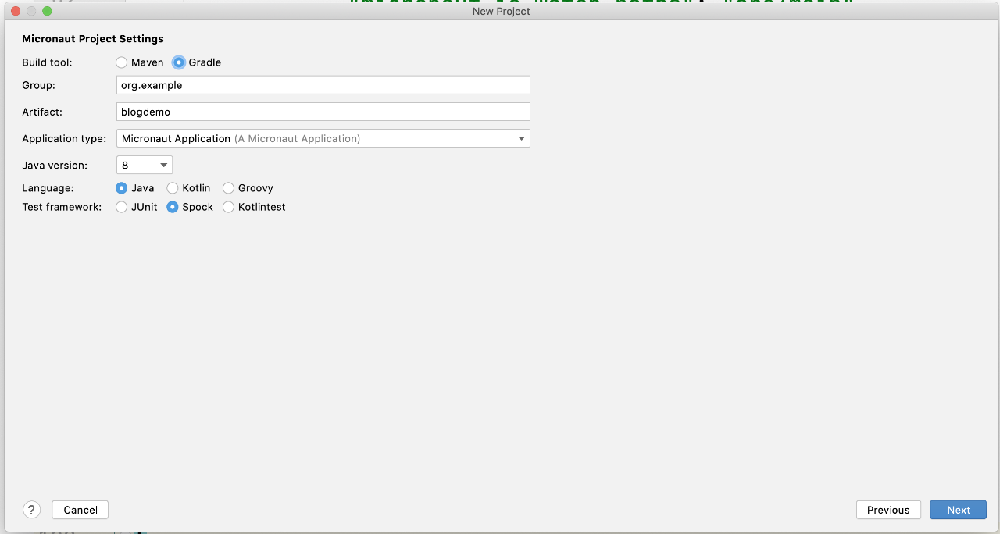
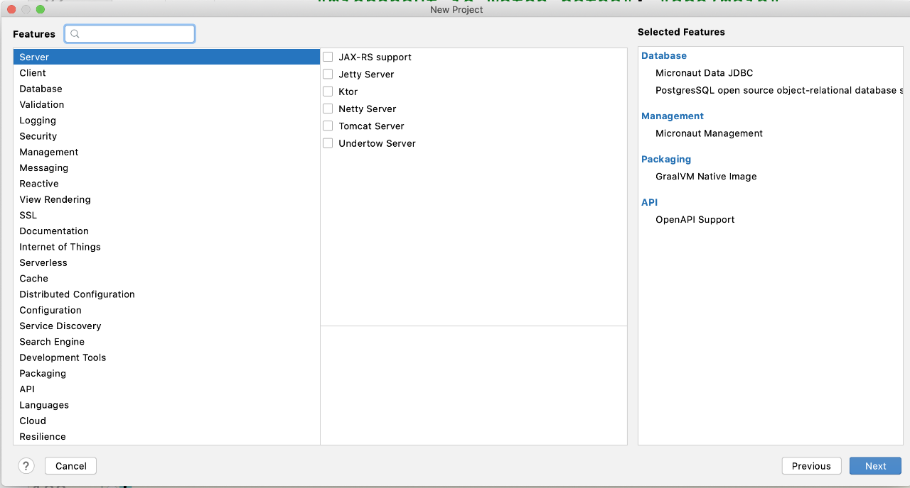
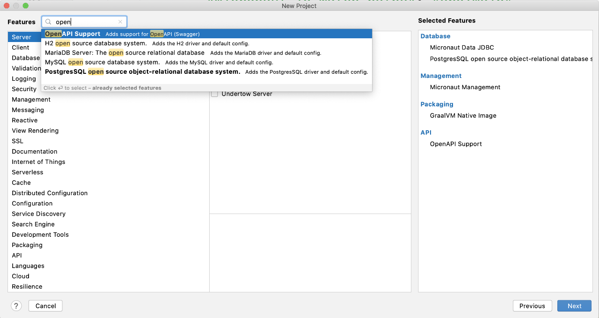
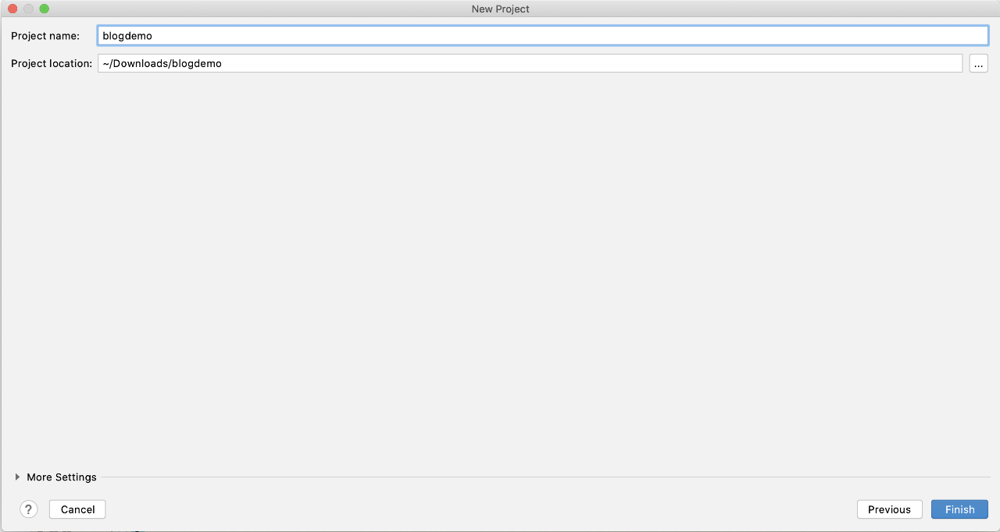

# [%title]

[%author]

[%date] 

Tags: #intellijidea

[%description]

Use the same options available at [Micronaut Launch](http://launch.micronaut.io), directly from your IDE!

See [What's new with IntelliJ IDEA 2020.2](https://www.jetbrains.com/idea/whatsnew/#whats-new-20202).
