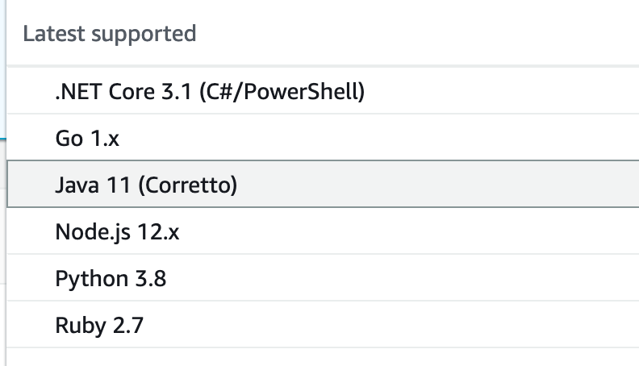
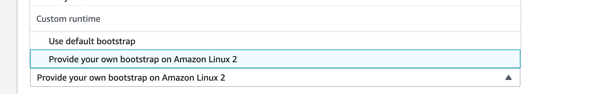

# [%title]

[%author]

[%date] 

Tags:  #aws #micronaut2

[%description]

## Micronaut Application Types for AWS Lambda Functions

In [Micronaut Launch](https://launch.micronaut.io), you can select the feature `aws-lambda` for applications of type `Application` or `Serverless Function`. Those application types have their CLI-equivalent commands.

| Application Type |  CLI Command |
| --- | --- |
| `Application`  | `create-app` |
| `Serverless Function`  | `create-function-app` |

## AWS Lambda Considerations

To deploy an AWS Lambda function, you have to: 
- Select a runtime
- Choose how your Lambda is triggered
- Specify your Handler
- Upload your code 

The above decisions influence the type of Micronaut application you choose. 

## Select a Runtime

To deploy a Micronaut function to AWS Lambda, choose an [AWS Lambda Runtime](https://docs.aws.amazon.com/lambda/latest/dg/lambda-runtimes.html). For Micronaut functions, select a Java (8 or 11) or custom runtime. To deploy your Micronaut function as a [GraalVM Native Image](https://www.graalvm.org/reference-manual/native-image/), select a custom runtime. 

## Application Type, Runtime, and Dependencies

Depending on your application type and runtime, you need different dependencies: 

| Application Type | AWS Lambda Runtime | ArtifactId |
| --- | --- | --- |
| Application | Java 8/11 | `micronaut-function-aws-api-proxy` 
| Application | GraalVM Native Image in a AWS Lambda Custom Runtime | `micronaut-function-aws-api-proxy`, `micronaut-function-aws-custom-runtime` | 
| Serverless Function | Java 8/ 11 | `micronaut-function-aws` | 
| Serverless Function | GraalVM Native Image in a AWS Lambda Custom Runtime | `micronaut-function-aws`, `micronaut-function-aws-custom-runtime` | 

`micronaut-function-aws-api-proxy` has a transitive dependency to `micronaut-function-aws`.

The previous set of artifacts have a group id of `io.micronaut.aws`. 

Micronaut CLI or Launch will include the necessary dependencies when you select the `aws-lambda` feature or both `aws-lambda` and `graalvm` features.

## Choose How Your Lambda Is Triggered

[AWS Lambda integrates with other AWS services](https://docs.aws.amazon.com/lambda/latest/dg/lambda-services.html) to invoke functions. The Micronaut application type you select depends on the triggers you want to support. To respond to incoming HTTP requests (e.g. [AWS Lambda Proxy integrations in API Gateway](https://docs.aws.amazon.com/apigateway/latest/developerguide/set-up-lambda-proxy-integrations.html)), you can choose either `Application` or `Serverless Function`. For other triggers, such as consuming events from a queue or running on a schedule, choose `Serverless Function`.

| Application Type |  Trigger type |
| --- | --- |
| `Application` or `Serverless Function`  | HTTP requests to a single endpoint |
| `Application`  | HTTP requests to multiple endpoints |
| `Serverless Function`  | S3 events, events for a queue, schedule triggers etc. |

On the one hand, if you need to support a single endpoint, a `Serverless Function` gives you a function with less code (which translates to a faster cold startup). 

Functions written as an application of type `Application` allow you to code with a more familiar paradigm — classes annotated with `@Controller`. This is possible because, through the `micronaut-function-aws-api-proxy` dependency, Micronaut integrates with the [AWS Serverless Java Container](https://github.com/awslabs/aws-serverless-java-container) project.

## Handlers 

[AWS Lambda Function Handler](https://docs.aws.amazon.com/lambda/latest/dg/java-handler.html)

> Your Lambda function's handler is the method in your function code that processes events. When your function is invoked, Lambda runs the handler method. When the handler exits or returns a response, it becomes available to handle another event.

The [aws-lambda-java-core](https://github.com/aws/aws-lambda-java-libs/tree/master/aws-lambda-java-core) library defines two interfaces for handler methods. When coding your functions with Micronaut, you don't implement those interfaces directly. Instead, you extend or use its Micronaut equivalents:

| Application Type | AWS Handler Interface | Micronaut Handler Class |
| --- | --- | --- |
| Serverless Function | [RequestHandler](https://github.com/aws/aws-lambda-java-libs/blob/master/aws-lambda-java-core/src/main/java/com/amazonaws/services/lambda/runtime/RequestHandler.java) | [MicronautRequestHandler](https://micronaut-projects.github.io/micronaut-aws/latest/api/io/micronaut/function/aws/MicronautRequestHandler.html) 
| Serverless Function | [RequestStreamHandler](https://github.com/aws/aws-lambda-java-libs/blob/master/aws-lambda-java-core/src/main/java/com/amazonaws/services/lambda/runtime/RequestStreamHandler.java) | [MicronautRequestStreamHandler](https://micronaut-projects.github.io/micronaut-aws/latest/api/io/micronaut/function/aws/MicronautRequestStreamHandler.html)
| Application | `RequestStreamHandler < AwsProxyRequest , AwsProxyResponse >` | [MicronautLambdaHandler](https://micronaut-projects.github.io/micronaut-aws/latest/api/io/micronaut/function/aws/proxy/MicronautLambdaHandler.html) |

For functions of type `Application`, use the handler [io.micronaut.function.aws.proxy.MicronautLambdaHandler](https://micronaut-projects.github.io/micronaut-aws/latest/api/io/micronaut/function/aws/proxy/MicronautLambdaHandler.html).

To resolve that class, add the `micronaut-function-aws-api-proxy` dependency to your build. 

For Serverless Functions, the decision to use one `MicronautRequestHandler` or `MicronautRequestStreamHandler` depends on how you want to handle the input and output types. 

To resolve those classes, add the `micronaut-function-aws` dependency to your build.

With [MicronautRequestHandler](https://micronaut-projects.github.io/micronaut-aws/latest/api/io/micronaut/function/aws/MicronautRequestHandler.html), it is expected that you supply generic types with the input and the output types. If you wish to work with raw streams, then subclass [MicronautRequestStreamHandler](https://micronaut-projects.github.io/micronaut-aws/latest/api/io/micronaut/function/aws/MicronautRequestStreamHandler.html) instead.

| Input / Output Types  | Handler |
| --- | --- |
| Supply generic types with the input and output  | Class which extends [MicronautRequestHandler](https://micronaut-projects.github.io/micronaut-aws/latest/api/io/micronaut/function/aws/MicronautRequestHandler.html) |
| Raw streams | [MicronautRequestStreamHandler](https://micronaut-projects.github.io/micronaut-aws/latest/api/io/micronaut/function/aws/MicronautRequestStreamHandler.html) |

## Cold Startups

Instances of Lambdas are added and removed dynamically. 
When a new instance handles its first request, the response time increases, which is called a cold start. After that request is processed, the instance stays alive (≈10 m) to be reused for subsequent requests.

Lambdas execution has different phases (initialization, invocation ...). 

During the initialization phase: 
- AWS Lambda starts a JVM.
- Java runtime loads and initializes handler class.
- Lambda calls the handler method.

The intialization phase has access to more CPU; because of that, Micronaut starts the application context and eagerly inits singletons during the intialization of the handler class. 

## GraalVM and AWS Custom Runtimes

[GraalVM](https://www.graalvm.org/) is a universal virtual machine that allows you to compile Java programs to [native executables](https://www.graalvm.org/reference-manual/native-image/). 

The introduction of [AWS Lambda custom runtimes](https://docs.aws.amazon.com/lambda/latest/dg/runtimes-custom.html) enables cold startup improvements for Java applications running in AWS Lambda.

> A runtime is a program that runs a Lambda function's handler method when the function is invoked. You can include a runtime in your function's deployment package in the form of an executable file named bootstrap.

Micronaut's dependency `micronaut-function-aws-custom-runtime` eases the creation of AWS Lambda Custom runtime to execute a Micronaut function.

The main API you will interact with is [AbstractMicronautLambdaRuntime](https://micronaut-projects.github.io/micronaut-aws/latest/api/io/micronaut/function/aws/runtime/AbstractMicronautLambdaRuntime.html). An abstract class that you can extend to create your custom runtime is `mainClass`. That class includes the necessary code to perform the [Processing Tasks](https://docs.aws.amazon.com/lambda/latest/dg/runtimes-custom.html#runtimes-custom-build) described in the Custom Runtime documentation.

When you generate a project with Micronaut CLI or [Micronaut Launch](https://launch.micronaut.io) with `aws-lambda` and `graalvm` features, the output includes the necessary files to generate a ZIP file to distribute your functions as a GraalVM Native Image executed from a AWS Lambda custom runtime. 

## Next Steps 

We have written several step-by-step tutorials to get you started: 

| Application Type | Runtime | Tutorial |
| --- | --- | --- | 
| Application | Java 11 | Deploy a Micronaut application to AWS Lambda Java 11 Runtime [JAVA](https://guides.micronaut.io/mn-application-aws-lambda-java11/guide/index.html) [KOTLIN](https://guides.micronaut.io/mn-application-aws-lambda-java11-kotlin/guide/index.html) [GROOVY](https://guides.micronaut.io/mn-application-aws-lambda-java11-groovy/guide/index.html)
| Application | GraalVM Native Image Custom Runtime | Deploy a Micronaut application as a GraalVM Native Image to AWS Lambda [JAVA](https://guides.micronaut.io/mn-application-aws-lambda-graalvm/guide/index.html) [KOTLIN](https://guides.micronaut.io/mn-application-aws-lambda-graalvm-kotlin/guide/index.html)
| Serverless Function | Java 11 | Deploy a Serverless Micronaut function to AWS Lambda Java 11 Runtime [JAVA](https://guides.micronaut.io/mn-serverless-function-aws-lambda/guide/index.html) [KOTLIN](https://guides.micronaut.io/mn-serverless-function-aws-lambda-kotlin/guide/index.html) [GROOVY](https://guides.micronaut.io/mn-serverless-function-aws-lambda-groovy/guide/index.html)
| Serverless Function | GraalVM Native Image Custom Runtime | Deploy a Serverless Micronaut function as a GraalVM Native Image to AWS Lambda [JAVA](https://guides.micronaut.io/mn-serverless-function-aws-lambda-graalvm/guide/index.html)

Check the [Micronaut AWS documentation](https://micronaut-projects.github.io/micronaut-aws/latest/guide/index.html#apiProxy) to learn more.

