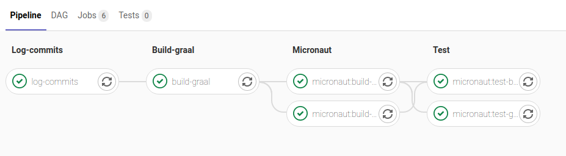
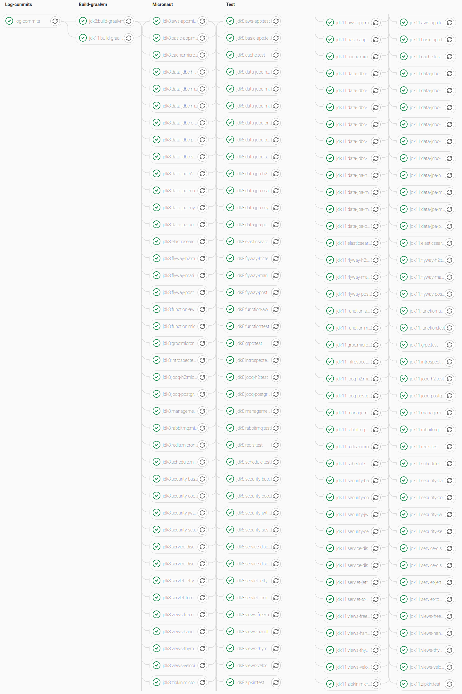
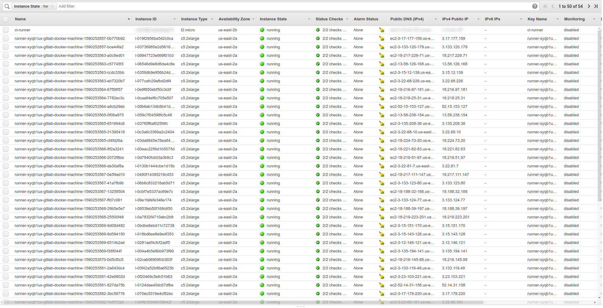
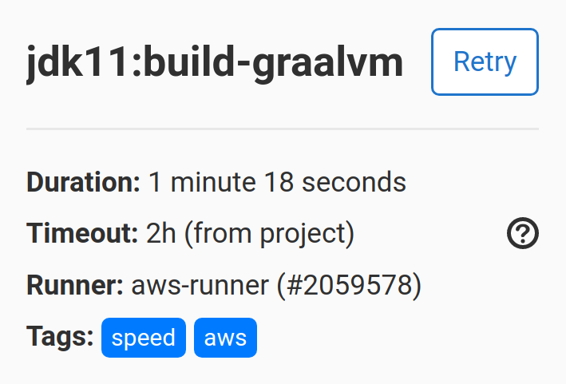
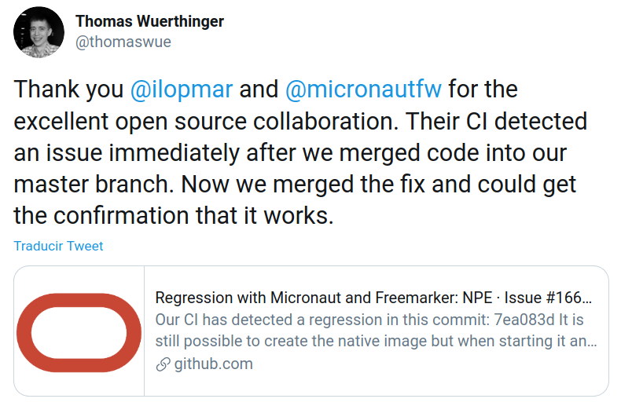

# [%title]

[%author]

[%date]

Tags: #micronaut #graalvm #test #gitlabci

Micronaut was the first big Java framework that included support out-of-the-box for [GraalVM](https://www.graalvm.org/). 
It was included since Micronaut 1.0 that was released in October 2018. I still remember the _old days_ when the integration
worked for GraalVM 1.0-RC6 but then something changed, and it failed for 1.0-RC7, and then it worked again for 1.0-RC8, and
 then it failed...

We needed to make sure we were able to test the integration before the GraalVM team released a new version so any 
issues and regressions could be fixed.

It was January 2019 (less than three months after we [released Micronaut 1.0](https://micronaut.io/blog/2018-10-23-micronaut-10-ga-released.html))
and by that time we still used Travis CI for testing Micronaut. Travis had a lot of constraints that didn't fit well with
GraalVM, specifically a really low memory limit, hard to create complex CI workflows and no support for creating artifacts
and use them in next jobs in the CI pipeline. So we needed another way...

## Introducing Gitlab CI

[Gitlab CI](https://docs.gitlab.com/ee/ci/) is part of [Gitlab](https://about.gitlab.com/) although you don't need to use the
latter to use the CI. I already knew it because I used it a lot in my previous job and I really love it.

The idea was to create a CI pipeline with the following objectives in mind:

- Execute it every periodically vs every commit.
- Only if there were changes in either Micronaut or GraalVM.
- Compile GraalVM from `master` branch, so we could detect any issue or regression when they were introduced and not in the next release.
- Test different Micronaut applications easily.
- Different CI stages and jobs with some dependencies between them.

After a week of work in [this new repository](https://gitlab.com/micronaut-projects/micronaut-graal-tests) and after tried different
approaches, this was the first [CI pipeline](https://gitlab.com/micronaut-projects/micronaut-graal-tests/-/pipelines/43802345)
 that passed the build:

It has four different stages that we still use:

- **Log-commits**: Simply save the commits that triggered the build for both Micronaut and GraalVM. If the build fails we can
check those commits and see why it failed.
- **Build-graal**: Clone the GraalVM repository and build it from `master` branch. The GraalVM JDK distribution generated in
this stage is saved as an _artifact_ to use it in the next stage. 
- **Micronaut**: Clone different Micronaut test applications and build a native image using the GraalVM distribution created 
in the previous stage. The native images are saved again as artifacts, so they can be used for the tests.
- **Test**: Start the native images generated in the previous stage and run some tests to make sure everything works as expected.
These tests are `curl` requests to different endpoints and we check the response.

For keeping track of new commits in Micronaut and GraalVM, and running the scheduled jobs, we have
[another companion project](https://gitlab.com/micronaut-projects/micronaut-graal-tests-scheduler) in which we store the
 latest commit for both projects and decide if we trigger the CI in the main repository.

## Test applications

Over this time a lot of things have changed, and those initial two applications have become 26 test applications with 39
different jobs. This is because some of them test the same thing but for different options. For example in the 
[Micronaut JDBC](https://github.com/micronaut-graal-tests/micronaut-data-jdbc-graal) test application, there are branches
for the all the databases supported: H2, Postgres, Oracle, MariaDB, SQL Server and MySQL.

Also, the number of jobs have been multiplied by four because we now test GraalVM for JDK 8 and JDK11, and we also test
 at two Micronaut versions (at this moment `2.0.x` and `2.1.x`). This is how the CI pipeline looks like today:

Very long an beautiful list, right? ;-)

The list includes test applications for RabbitMQ, gRPC, Service Discovery with Consul and Eureka, Security, Micronaut 
Data, Flyway, Elasticsearch, Redis,... and many more. We are increasing the list with new applications, and we are
committed to have more and more things supported in every release.

## Own runners on AWS

Some months ago we hit a limit on the Gitlab CI shared runners that we use. A few jobs were failing when building the native
images because of an out of memory exception. Basically they didn't have enough memory to build the native image, and the
 process failed.

Gitlab CI provides a way to use [your own runners](https://docs.gitlab.com/runner/) so we setup 
[auto-scaling runners](https://docs.gitlab.com/runner/configuration/runner_autoscale_aws/) infrastructure on AWS for
those jobs that needed additional memory.

For choosing the right instance type I did some tests without limiting the number of instances launched during the auto-scale. 

| Instance | Specs | Time to run pipeline | CPU usage |
| --- | --- | --- | --- | 
| c5.xlarge | 4 CPUs - 8 GB RAM | 17 mins | 60-70% |
| c5.2xlarge | 8 CPUs - 16 GB RAM | 13 mins | 30-40% |
| c5.24xlarge | 96 CPUs - 192 GB RAM | 43 mins | 10% |

You may wonder why using a huge instance like `c5.24xlarge` takes almost 3 times more to run the CI pipeline than
the others. The answer is that you can only allocate up the 512 CPUs on AWS without asking support to increase the number,
so choosing the biggest instance only allowed to run 5 of them in parallel.

With those numbers it felt right to choose `c5.xlarge` because the time difference with `c5.2xlarge` wasn't too much, and
the former maximized the cpu usage and costs half the latter.

Eventually I have moved some other jobs to run on our AWS runners because of the time it takes to build some native images. 
They are so fast compared to the shared runners that they can build almost three native images in the time the shared runners
only build one. With the current mix of shared and own runners the build takes around 35-40 minutes to finish.

If you are curious about the time improvement for those of some jobs:

| App | Shared runners | Own runners |
| --- | --- | --- |
| GraalVM | [23 min](https://gitlab.com/micronaut-projects/micronaut-graal-tests/-/jobs/548418789) | [7 min 29 sec](https://gitlab.com/micronaut-projects/micronaut-graal-tests/-/jobs/561601061) |
| MS SQL | [14 min 18 sec](https://gitlab.com/micronaut-projects/micronaut-graal-tests/-/jobs/568011290) | [5 min 33 sec](https://gitlab.com/micronaut-projects/micronaut-graal-tests/-/jobs/569072355) |
| gRPC (server + client) | [35 min](https://gitlab.com/micronaut-projects/micronaut-graal-tests/-/jobs/686515921) | [7 min 3 sec](https://gitlab.com/micronaut-projects/micronaut-graal-tests/-/jobs/686618254) |

With Gitlab CI is pretty simple to configure a job to run on our own runners. It's a matter of tag it with one of the
tags `aws`, `memory` or `speed`. I use the combinations `aws` + `memory` or `aws` + `speed` as a way to document why
that specific job is running on our own runners.

## Test dev-release versions

Some time ago the GraalVM team started to publish [dev-releases](https://github.com/graalvm/graalvm-ce-dev-builds/releases)
every few days for the community to test GraalVM in case you don't want to compile everything from source code. They asked
us if we could test that Micronaut was working with the latest _dev-release_ just a few days before of releasing a final 
GraalVM version.  
As we have a very granular and flexible CI pipeline it was easy for us to add a new branch and automate the tests for
those _dev-releases_.
Now, we have a scheduled job that is executed every 2 or 3 days that automatically downloads the latest _dev-release_ available
and run all the tests with it.  
For the curious, everything remains the same, and the only change is in the [GraalVM build script](https://gitlab.com/micronaut-projects/micronaut-graal-tests/-/blob/2.1.x_dev-preview/build-graalvm.sh#L9)
 that now downloads the latest _dev-release_ version. 

## Was it worth the effort?

What started like a small thing has evolved a lot in these 21 months. The time has proved that it was really worth the effort
we put into this. For example, just a few days ago the [gRPC test application failed](https://gitlab.com/micronaut-projects/micronaut-graal-tests/-/jobs/774292619)
and I was able to track down the commit that broke the build and [report and issue](https://github.com/oracle/graal/issues/2896)
to the GraalVM team. Then, just a few days later they have fixed it and our build [is back to green](https://gitlab.com/micronaut-projects/micronaut-graal-tests/-/pipelines/199942162) :-)

Speaking about reporting issues, we have been working together with them to improve the GraalVM support in Micronaut
and I've reported a lot of issues to make GraalVM better.

We, the Micronaut team at Object Computing, will continue to improve the GraalVM integration in every Micronaut release,
 and we will make sure it's easier to use for our users.  
This support has been improved a lot in Micronaut 2.1 with our new [Micronaut Gradle plugin](https://github.com/micronaut-projects/micronaut-gradle-plugin).
Take a a look at [this video](https://micronaut.io/blog/2020-10-08-micronaut-gradle-plugin.html) in which Graeme Rocher 
does a demo of it.

For Micronaut 2.2 we also plan to release an improved version of our current [Micronaut Maven plugin](https://github.com/micronaut-projects/micronaut-maven-plugin)
which will include these new features as well.
