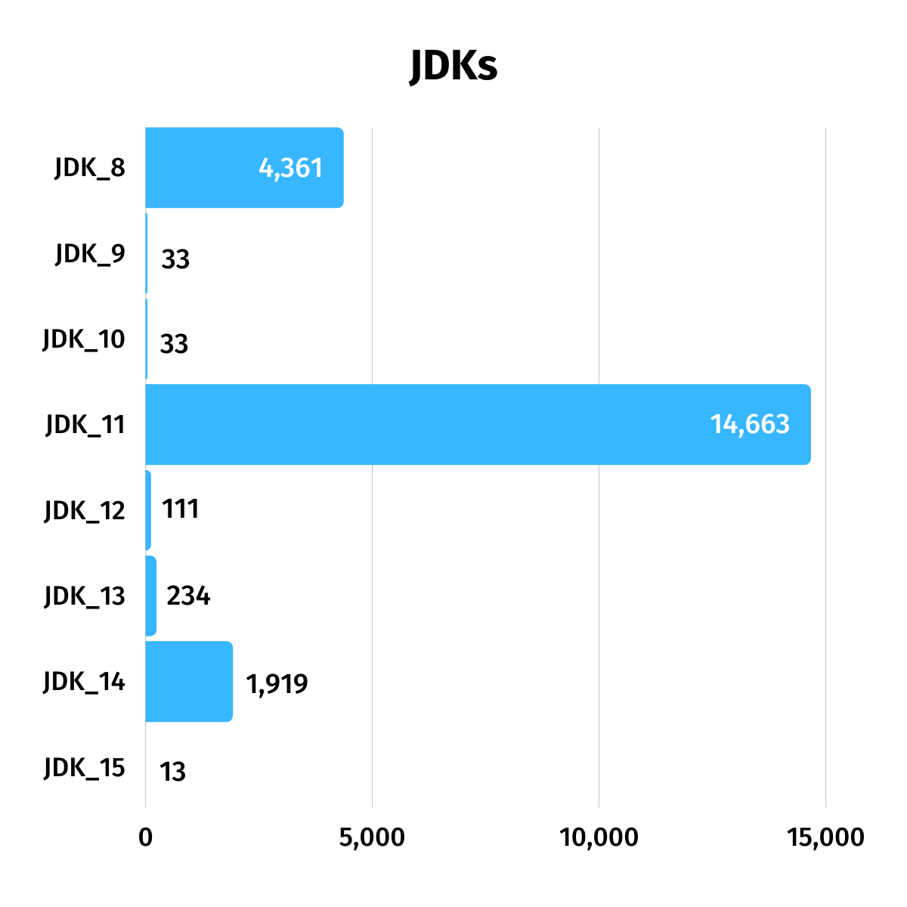
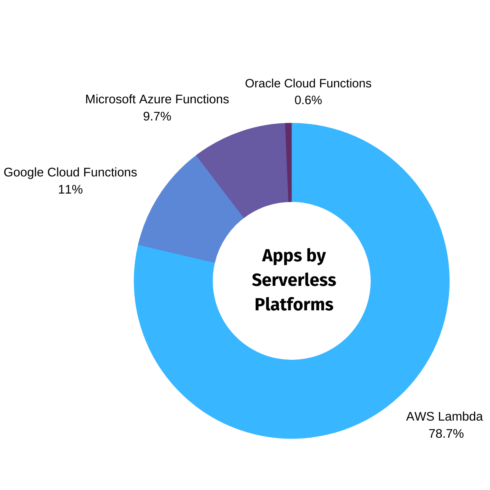
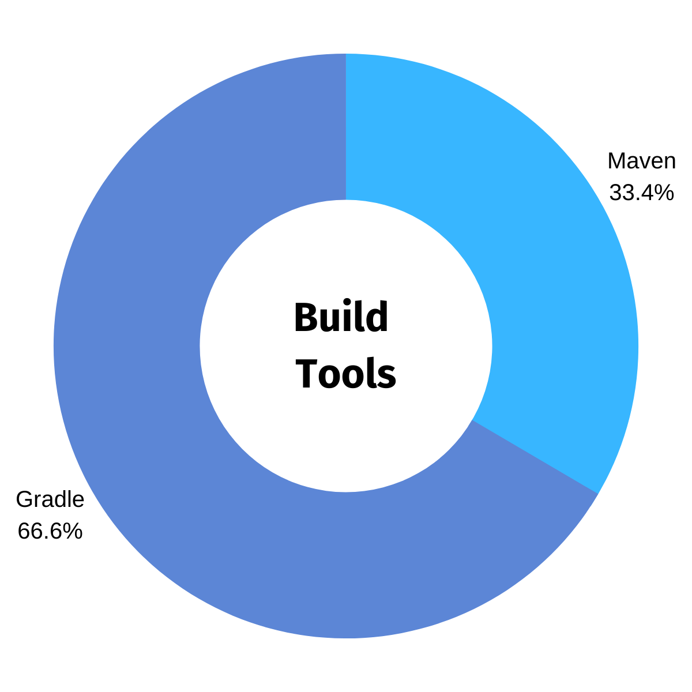

# [%title]

[%author]

[%date] 

Tags: #launch

Back in April with the release of Micronaut 2.0 M3, we went live with a brand new implementation of the Micronaut command line interface (CLI) and [Micronaut Launch](https://micronaut.io/launch/), an online tool for creating Micronaut applications. Micronaut Launch features a core written in Micronaut itself and a [micronaut-cli module that targets the user's command line](https://github.com/micronaut-projects/micronaut-starter/tree/master/starter-cli) and uses [PicoCLI](https://picocli.info/). 

Micronaut Launch has been helping you get your Micronaut apps off the ground for six months now, and we've found the data related to its use pretty interesting.

So, to begin, a total of 21,367 apps have been created using Micronaut Launch since its introduction on April 30th! That's about 3,561 apps a month and approximately 116 apps per day!

Currently, Micronaut supports JDK 8 through JDK 15. As you can see, a vast majority of you are building your Micronaut applications with JDK 11, which is the default option in the launch website.

Micronaut Launch provides maximum flexibility to run your own version of Launch for internal teams and choose the platform (serverless or not) that best suits your needs. As a testament to Micronaut 2.0's flexibility, you can take the same application and run it across a variety of serverless platforms ([AWS Lambda](https://aws.amazon.com/lambda/), [Google Cloud Functions](https://cloud.google.com/functions), [Microsoft Azure Functions](https://azure.microsoft.com/en-us/services/functions/), and [Oracle Cloud Functions](https://www.oracle.com/cloud-native/functions/)). You can also build a regular [Netty](https://github.com/micronaut-projects/micronaut-starter/tree/master/starter-web-netty) or Servlet application from the same codebase.

Below you can see which cloud deployment platforms are configured most often. AWS Lambda is the hands-down favorite.

The Micronaut Launch UI also includes support for a ton of popular features. Of all the features available, the two selected most often are [Micronaut Data](https://micronaut-projects.github.io/micronaut-data/latest/guide/) and [Micronaut Security](https://micronaut-projects.github.io/micronaut-security/latest/guide/). 

Of the build tools available through Micronaut Launch, Gradle shows 2:1 more popular than Maven. Gradle is the default build tool on the launch website.

As for test frameworks, JUnit is preferred by more than three quarters of users.

Finally, Micronaut apps can currently be built using Java, Kotlin, and Groovy (with Scala on the roadmap!). More than half of you prefer Java. Both Java and JUnit are the default options in the launch website.

Micronaut Launch is a fantastic example of modern application development using Micronaut. The launch application itself is a [GraalVM Native Image](https://www.graalvm.org/reference-manual/native-image/) deployed as a serverless function. The new CLI build pipeline creates GraalVM native images for Linux, macOS, and Windows. The native images are then published to SDKMAN and other package managers to make installation easy. GraalVM has changed the JVM landscape for the better, and we are happy to benefit from and contribute to its success.

Micronaut Launch has also given us more insight into the features the Micronaut community finds most valuable and would like to see added in the future. A big thanks to everyone who has submitted issues to the launch repo to request new features, report bugs, and provide valuable feedback. 

Keep an eye out for Kotlin DSL for Gradle support, coming in November!

[Let us know what you think about Micronaut Launch!](https://github.com/micronaut-projects/micronaut-starter/issues)

