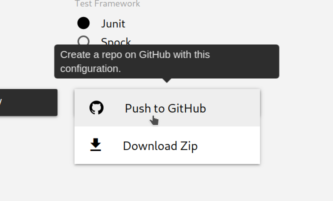
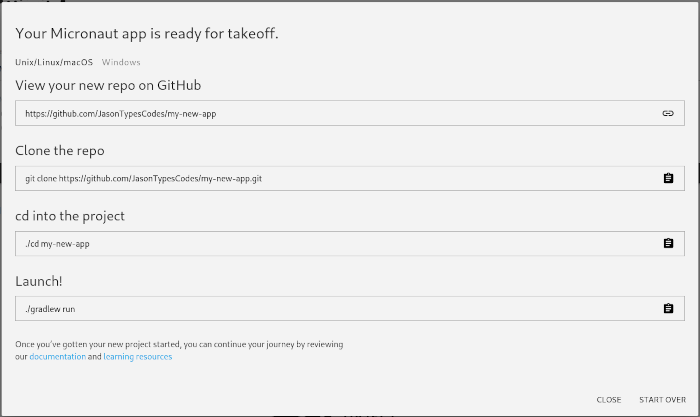

# [%title]

[%author]

[%date]

Tags: #release #micronaut2 #maven #launch #github #mqtt #r2dbc #security

The [Micronaut team](https://objectcomputing.com/products/2gm-team) is excited to announce the release of [Micronaut 2.2!](https://docs.micronaut.io/2.2.0/guide/index.html)
This release features MQTT support, packaging and configuration enhancements for the [Micronaut Maven Plugin](https://micronaut-projects.github.io/micronaut-maven-plugin/1.1.0/), pushing a new project directly to [GitHub](https://github.com) from [Micronaut Launch](https://micronaut.io/launch/), a preview of R2DBC support with [Micronaut Data](https://micronaut-projects.github.io/micronaut-data/latest/guide/index.html), and a bunch of [other enhancements](https://docs.micronaut.io/2.2.0/guide/index.html#whatsNew)!

## MQTT

Micronaut 2.2 includes a brand new configuration for [MQTT](https://micronaut-projects.github.io/micronaut-mqtt/latest/guide/) support!
Similar to our existing [Kafka](https://micronaut-projects.github.io/micronaut-kafka/latest/guide/) and [RabbitMQ](https://micronaut-projects.github.io/micronaut-rabbitmq/latest/guide/) configurations, Micronaut MQTT provides support for using annotations to publish and consume data from topics that use MQTT version 3 or 5.

Here is an example interface that will create a MQTT publisher for a topic called `product`:

```java
import io.micronaut.mqtt.annotation.Topic;
import io.micronaut.mqtt.v5.annotation.MqttPublisher;

@MqttPublisher
public interface ProductClient {

    @Topic("product")
    void send(byte[] data);
}
```

You can build a subscriber for this topic using the [@MqttSubscriber](https://micronaut-projects.github.io/micronaut-mqtt/latest/api/io/micronaut/mqtt/annotation/MqttSubscriber.html) annotation:

```java
import io.micronaut.mqtt.annotation.MqttSubscriber;
import io.micronaut.mqtt.annotation.Topic;

import java.util.ArrayList;
import java.util.Collections;
import java.util.List;

@MqttSubscriber
public class ProductListener {

    List<String> messageLengths = Collections.synchronizedList(new ArrayList<>());

    @Topic("product")
    public void receive(byte[] data) {
        messageLengths.add(new String(data));
        System.out.println("Java received " + data.length + " bytes from MQTT");
    }
}
```

For more information and configuration options, please see the [Micronaut MQTT Guide](https://micronaut-projects.github.io/micronaut-mqtt/latest/guide/)!

## Native Image and Docker support in Maven Plugin

The latest [Micronaut Maven Plugin](https://micronaut-projects.github.io/micronaut-maven-plugin/1.1.0/) includes first-class support for a number of packaging options including:

+ Runnable fat Jars
+ Docker Images
+ GraalVM Native Images

To configure your project's runtime and preferred package, you can declare the following properties:

```xml
<project>
    <packaging>${packaging}</packaging>
    <properties>
        <!-- ... -->
        <packaging>jar</packaging>
        <micronaut.runtime>netty</micronaut.runtime>
    </properties>
    <build>
        <plugins>
            <!-- ... -->
            <plugin>
                <groupId>io.micronaut.build</groupId>
                <artifactId>micronaut-maven-plugin</artifactId>
            </plugin>
        </plugins>
    </build>
</project>
```

Now, running `mvn package` will package your Micronaut project into a runnable jar that includes the Netty runtime!
To package your application as a GraalVM native image or a Docker image, you can set your `packaging` property to `native-image` or `docker`.
For a Docker image that contains a GraalVM native image, use `docker-native`.

`mvn package -Dpackaging=native-image`

For a full list of options and features, please see the [Micronaut Maven Plugin documentation](https://micronaut-projects.github.io/micronaut-maven-plugin/1.1.0/).

## Push to GitHub

[Micronaut Launch](https://micronaut.io/launch/) learned a new trick!  Starting with version 2.2.0, you can push new Micronaut projects directly to GitHub!

First, select the options and features that you would like for your new Micronaut project.  Now, when you select "Generate Project", pick the "Push to GitHub" option:



After authenticating with GitHub, your new project will be available to you as a brand new repository:



Congratulations!  Now you can `git clone ...` and go!

## Try it out!

Create a new Micronaut 2.2 application with [Micronaut Launch](https://micronaut.io/launch/), or visit our [Download](https://micronaut.io/download.html) page for other options to get started including installing the latest [Micronaut CLI](https://micronaut-projects.github.io/micronaut-starter/latest/guide/#introduction).

This is just a sampling of the enhancements that come with Micronaut 2.2.  This release also includes [JSON Feed](https://www.jsonfeed.org/) support, [Micronaut Security](https://micronaut-projects.github.io/micronaut-security/latest/guide/) now supports [Client Credentials Grant](https://tools.ietf.org/html/rfc6749#section-4.4), and the [Gradle plugin](https://github.com/micronaut-projects/micronaut-gradle-plugin) received an improvement to allow for testing with native images.  For a full description of this release, please see the [What's New](https://docs.micronaut.io/2.2.0/guide/index.html#whatsNew) section of the [guide](https://docs.micronaut.io/2.2.0/guide/index.html).

For Micronaut Documentation, Guides, and API information see our [Documentation](https://micronaut.io/documentation.html) page.

To learn more about using Micronaut, check out [these learning resources](https://micronaut.io/learn.html).

## Thank You!

This release would not have been possible without the contributions and support of the amazing Micronaut community!  Thank you to all that have contributed time, effort, and energy to making Micronaut a world-class framework for developing applications on the JVM.

We would also like to thank the Technical Advisory Board, Board of Directors, and Contributing Members of the [Micronaut Foundation](https://micronaut.io/foundation/).  The Micronaut Foundation is a not-for-profit organization that exists to support and collectively lead the open source Micronaut project.  To learn more about the Micronaut Foundation including how you can help support the continued growth and enhancement of the Micronaut framework, please visit the [Micronaut Foundation](https://micronaut.io/foundation/) or reach out to [foundation@micronaut.io](mailto:foundation@micronaut.io).
