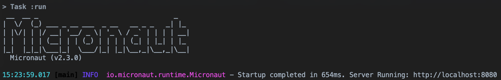

# [%title]

[%author]

[%date]

Tags: #release #micronaut2 #jms #locale #introspection

The Micronaut team is excited to announce the release of Micronaut 2.3! This release features improvements to introspections and locale resolution support, support for JMS, many incremental improvements to many modules, and a startup banner!

# JMS

Micronaut 2.3 includes a milestone version of support for JMS. Similar to our other messaging solutions, Micronaut JMS makes it easy to publish and subscribe to queues with activemq artemis, activemq classic, or Amazon SQS.

Simply define an interface, and it will be implemented for you to do the work of publishing the message.


```
@JMSProducer("activeMqConnectionFactory")
public interface TextProducer {

    @Queue("queue_text")
    void send(@Body String body);
}
```

Create a class annotated with `JMSListener`, and the work to listen to the queue will be done for you, and your method will be called when a message arrives.


```
@JMSListener(activeMqConnectionFactory)
public class TextConsumer {

    List<String> messages = Collections.synchronizedList(new ArrayList<>());

    @Queue(value = "queue_text", concurrency = "1-5")
    public void receive(@Body String body) {
        messages.add(body);
    }
}
```

See the [Github repository](https://github.com/micronaut-projects/micronaut-jms) for more information. Special thanks to [Elliott Pope](https://github.com/elliottpope) for his major contributions to this area.

# Locale Resolution

Advanced support for resolving the locale from a request has been added, and it is now possible to simply inject a `Locale` argument into controller methods. It is now possible to customize where the locale information is retrieved from. See the [documentation](https://docs.micronaut.io/latest/guide/index.html#localeResolution) for the available configuration options.

# Introspections

Many improvements have been made to our introspection functionality to add support for executable methods and annotation metadata on generics. This will serve as the foundation of future work to add support for the current bean validation standard and improvements to Micronaut Data.

# Banner

A Micronaut banner will now greet you by default for applications using Micronaut 2.3. It can be customized and turned off. See the [documentation](https://docs.micronaut.io/latest/guide/index.html#_micronaut_banner) for more information.



